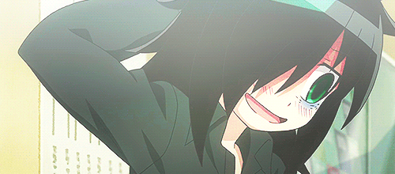

<h1 align="center">Hello, I am <a href="https://github.com/Aru-gxtx">Aru</a>! 👋</h1>

<h3 align="center">Welcome to my GitHub profilee 💬</h3>

<b>Pen Names:</b> Aru, Ⅾ翼

<b>Real Name:</b> Matthew Arni Bendo

<b>Loves:</b> Anime, Doujins, Manga, Manhua, Novels, Cute things, FPS, Rhythm, and Open World Games, Logical Puzzles, !brainrot contents

<b>Hobbies (Professional):</b> Animation (2d and 3d), Illustration, Graphic Design, Artificial Intelligence (learning), Machine Learning (learning), Small Content Creation and Game Development

<b>Hobbies (Random):</b> Badminton, Chess, Gomoku, Minesweeper, Tetoris, Bandori, Project Sekai, Rhythm Hive, Osu

My real name is Matthew Arni Bendo. I’m 20 years old, and I am not married. I still study Computer Engineering, and I have free time every day by 8:00 PM at the latest. I don’t smoke. I’m in bed by 10:00 PM, and I make sure I get eight hours of sleep, no matter what. I usually have no problems sleeping until morning. Just like a baby, I wake up without any fatigue or stress in the morning.

    <b><a href="https://discord.gg/arnichan">Discord (Nijika)</a></b> |
    <b><a href="https://x.com/Aru327099275035">Twitter (Aru)</a></b> |
    <b><a href="https://x.com/dwings_arni">Twitter (Ⅾ翼)</a></b>

<h3 align="center">Languages 👨‍💻</h3>

<table align="center">
    <tbody>
        <tr>
            <th><b>Mastered</b></th>
            <td></td>
        </tr>
        <tr>
            <th><b>Decent</b></th>
            <td>
                
                
                
                
                
            </td>
        </tr>
        <tr>
            <th><b>Learning</b></th>
            <td>
                
                
            </td>
        </tr>
    </tbody>
</table>

<h3 align="center">Inquiry 😉</h3>

If you have any questions, or if you just want to hang out, or play a game together, feel free to contact me.

    <b><a href="mailto:takahashiai17@gmail.com">Email (Ai Takahashi)</a></b> |
    <b><a href="mailto:matthewarni.bendo@ssu.edu.ph">Email (Matthew Arni Bendo)</a></b> |
    <b><a href="mailto:12matth1arni20@gmail.com">Email (Matthew Arni Bendo)</a></b>

    

<!--
## Hi there 👋

**Aru-gxtx/Aru-gxtx** is a ✨ _special_ ✨ repository because its `README.md` (this file) appears on your GitHub profile.

Here are some ideas to get you started:

- 🔭 I’m currently working on ...
- 🌱 I’m currently learning ...
- 👯 I’m looking to collaborate on ...
- 🤔 I’m looking for help with ...
- 💬 Ask me about ...
- 📫 How to reach me: ...
- 😄 Pronouns: ...
- ⚡ Fun fact: ...
-->
